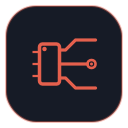
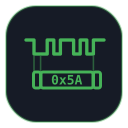
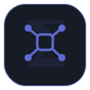
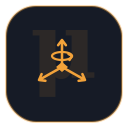
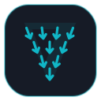

<div align="center">


&nbsp;
&nbsp;
&nbsp;
&nbsp;
&nbsp;
&nbsp;

# XMotion

**Everything that moves a mobile robot** — board, firmware, drivers, and the algorithms that steer them.

</div>

---

This repository is the **umbrella**: a thin CMake superbuild that assembles the components (pinned as git submodules under `components/`) and hosts family-level docs. Every component also stands alone — build, test, and `find_package` just the ones you need; the umbrella only fixes a known-good combination.

## Components

|   | Component | Role | Repo |
|---|-----------|------|------|
| **κ** | xmBoard | PCB / electronics (KiCAD) | [rxdu/xmBoard](https://github.com/rxdu/xmBoard) |
| **ζ** | xmFirmware | MCU firmware (Zephyr) | [rxdu/xmFirmware](https://github.com/rxdu/xmFirmware) |
| **Σ** | xmBase | foundation — logging · ipc · math · common types | [rxdu/xmBase](https://github.com/rxdu/xmBase) |
| **τ** | xmTelemetry | observability — logs · metrics · traces · black box | private¹ |
| **μ** | xmDriver | host hardware drivers — motor · CAN · serial · modbus · sbus · imu | [rxdu/xmDriver](https://github.com/rxdu/xmDriver) |
| **∇** | xmNavigation | motion algorithms — planning · control · estimation · mapping&nbsp;·&nbsp;*centerpiece* | [rxdu/xmNavigation](https://github.com/rxdu/xmNavigation) |
| **γ** | xmViewer | visualization | [rxdu/quickviz](https://github.com/rxdu/quickviz) |

Component names follow [ADR 0003](docs/adr/0003-naming-and-branding.md); the Greek letters (κ ζ Σ τ μ ∇ γ) are retained as logos only — every repo, submodule path, and icon file now carries its functional name. Everything builds on **xmBase**; dependencies point downward only. ¹ *xmTelemetry (the production observability SDK and tooling) is privately maintained — available for production integrations.* Two pairs span the boundary: **xmBase/xmDriver** on the host, **xmFirmware/xmBoard** on the embedded target — with **xmNavigation** the motion-algorithms core.

## Applications

Per-robot controllers — thin consumers of the stack, each in its own repo: [xmBot-Swerve](https://github.com/rxdu/xmbot-swerve) · [xmBot-Tracked](https://github.com/rxdu/xmbot-tracked) · [xmBot-Legged](https://github.com/rxdu/xmbot-legged).

## Build

```bash
git clone --recurse-submodules https://github.com/rxdu/xmotion.git
cd xmotion
cmake --preset default && cmake --build build
```

Each submodule is pinned to an exact commit, so `clone → configure → build` always reproduces a known-good set. Toggle components with `-DXMOTION_WITH_<NAME>=ON/OFF`.

## Documentation

[Decision records](docs/adr/) · [Telemetry design](docs/design/telemetry-library-design.md) · [Brand & icons](branding/README.md) · [Tasks](TODO.md)

## License

Apache-2.0 — see [LICENSE](LICENSE) and [NOTICE](NOTICE). Bundled third-party submodules retain their own licenses.
