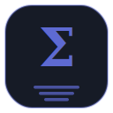

# xMotion brand — component icons

A cohesive icon set for the xMotion family. Each icon shares one visual language and differs by **accent color** and a **functional illustration of what the component does** — so they read as a set at a glance while each communicates its job, not just its name.

## Design system

- **Badge** — a dark rounded-square (`#161B26`, `rx=30` on a 128×128 grid) with a thin accent-colored rim. Common shape + shared line style = family cohesion.
- **Hero** — functional line-art of what the component *does* (a motor, a planned path, a PCB, an MCU…), drawn in the accent color with consistent stroke weight and rounded joins. `xmNabla`, the centerpiece, keeps a brighter rim.
- **Brand watermark** — the component's Greek symbol sits faintly behind the art (10% opacity), retaining the naming identity without competing with the function cue.

## The set

<table>
  <tr>
    <td align="center"></td>
    <td align="center"></td>
    <td align="center"></td>
    <td align="center"></td>
    <td align="center"></td>
    <td align="center"></td>
  </tr>
  <tr>
    <td align="center"><b>xmSigma</b> Σ</td>
    <td align="center"><b>xmMu</b> μ</td>
    <td align="center"><b>xmNabla</b> ∇</td>
    <td align="center"><b>xmGamma</b> γ</td>
    <td align="center"><b>xmZeta</b> ζ</td>
    <td align="center"><b>xmKappa</b> κ</td>
  </tr>
</table>

| Icon | Accent | Symbol | Icon depicts |
|------|--------|--------|--------------|
| **xmSigma** | `#5E6AD2` indigo | Σ | a hub of connected nodes — the runtime/event/IPC substrate everything plugs into |
| **xmMu** | `#F2A23A` amber | μ | an electric motor (rotor, poles, leads) — host hardware drivers |
| **xmNabla** | `#10B6C6` teal | ∇ | a planned trajectory through waypoints to a goal — motion algorithms (centerpiece) |
| **xmGamma** | `#C158DC` violet | γ | a viewer window plotting data — visualization |
| **xmZeta** | `#46B358` green | ζ | an MCU chip running a firmware signal — firmware (Zephyr) |
| **xmKappa** | `#E5604D` coral | κ | a PCB with traces, vias and a footprint — electronics (KiCAD) |

## Usage notes

- Files are plain SVG at 128×128; scale freely. For favicons/app icons, export to PNG at 16/32/48/256.
- **Production hardening:** all functional art is pure geometry; only the faint Greek **watermark** uses a system serif via `<text>`. For pixel-identical rendering everywhere (and to drop the font dependency), convert that text to outlines — e.g. Inkscape *Path → Object to Path*, or `inkscape --export-text-to-path` — or simply remove the watermark.
- Keep the dark badge; the accent color is the only thing that should change per component. A light-background variant can be added later if needed.
